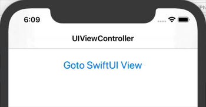
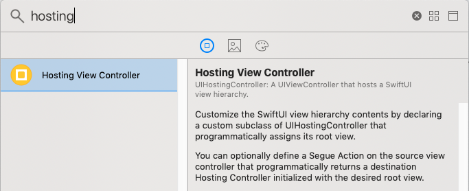
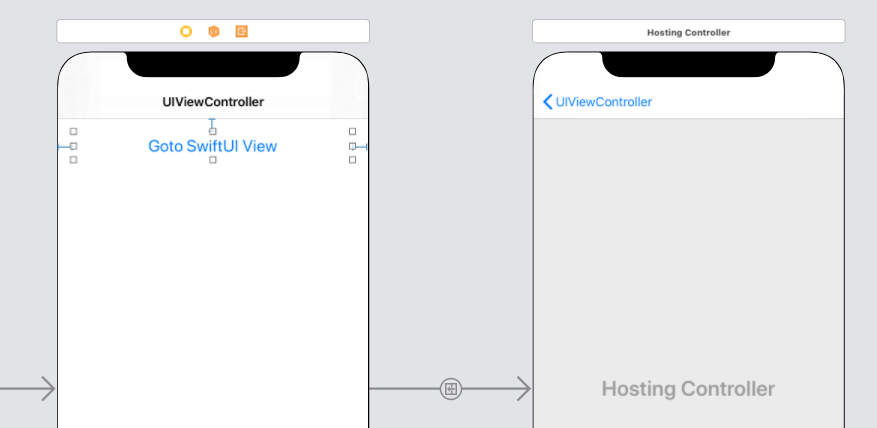
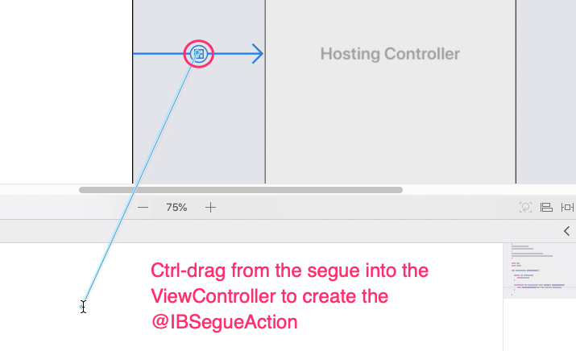

# Hosting SwiftUI Views in UIKit
## Using UIHostingController to display a SwiftUI View in a UIKit app
**(Updated for Xcode 11 Beta 5)**

This demo shows how to use **UIHostingController** to display a **SwiftUI View** in a **UIKit** app.

Integrating SwiftUI Views into existing UIKit apps is going to be a very common scenario. Happily, it seems pretty straightforward to accomplish.

In this demo we look at two different methods for integrating a SwiftUI View into an existing UIKit app:

* Navigating to a SwiftUI View via a @IBSegueAction created in Interface Builder 
* Programmatically navigating to a SwiftUI View



___

## Navigating to a SwiftUI View via a @IBSegueAction
**@IBSegueAction** was introduced in Xcode 11 and iOS 13. This means that any existing app that you want to use this feature in will have 
to target iOS 13. But then SwiftUI also requires you to target iOS 13. 

The Xcode 11 (beta 5) release notes state the following in relation to @IBSegueAction:

*A view controller method annotated with the new @IBSegueAction attribute can be used to create a segue’s destination view controller in code, 
using a custom initializer with any required values. … On new OS versions that support Segue Actions, that method will be called and the value 
it returns will be the destinationViewController of the segue object passed to prepareForSegue:sender:. Multiple @IBSegueAction methods 
may be defined on a single source view controller, which can alleviate the need to check segue identifier strings in prepareForSegue:sender:.*

To set this demo up I created a single view iOS app in the normal (pre-SwiftUI) manner. That is, I did **not** tick the “Use SwiftUI” checkbox 
when creating the project. I embedded the ViewController in a **UINavigationController** and added a “Goto SwiftUI View” button.

The simple SwiftUI View is defined as follows:

``` swift
struct SwiftUIView: View {
    var body: some View {
        VStack {
            Text("This is a SwiftUI View!").padding(.top)
            Spacer()
        }
    }
}
```

Switch to Interface Builder, open the **Library** and drag a **Hosting View Controller** onto the design surface.



Create a segue by ctrl-dragging from the "Goto SwiftUI View" button to the hosting controller:



Create the segue action by opening an assistant editor window containing **ViewController.swift** and ctrl-dragging from the segue 
arrow to the view controller:



You can now create a **ViewController** to host your SwiftUI View using **UIHostingController()**:

``` swift
@IBSegueAction func segue2SwiftUI(_ coder: NSCoder) -> UIViewController? {
    return UIHostingController(coder: coder, rootView: SwiftUIView())
}
```


If you run the app you should see that everything works as expected:


___

## Programmatically navigating to a SwiftUI View
To demonstrate programmatically navigating to our SwiftUI View I added another button to the main ViewController and created an 
**@IBAction** as follows:

``` swift
@IBAction func programmaticallyGotoSwiftUIViewTapped(_ sender: Any) {
    let vc = UIHostingController(rootView: SwiftUIView())
    navigationController?.pushViewController(vc, animated: true)
}
```

Again we use **UIHostingController()** to create a UIViewController to host our SwiftUI View.
